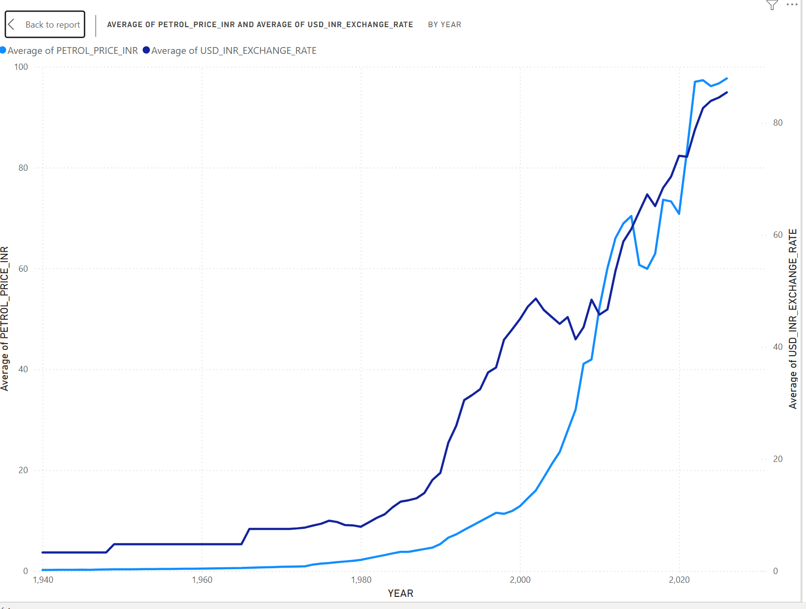
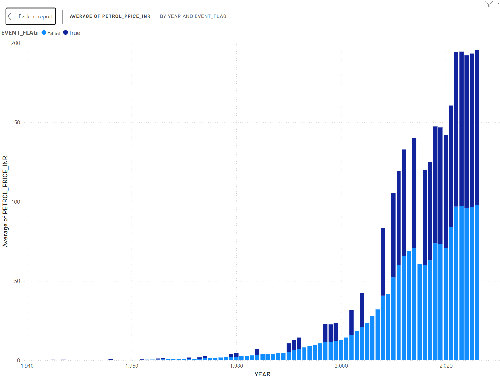
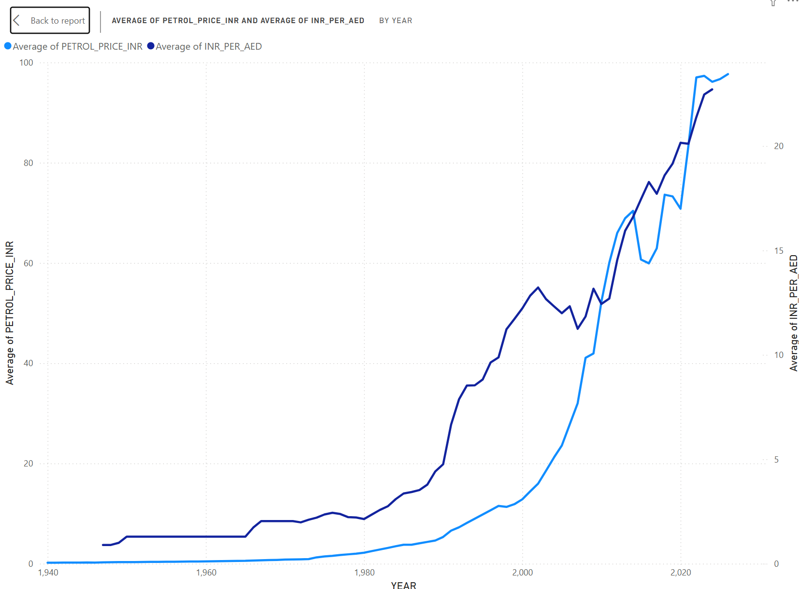
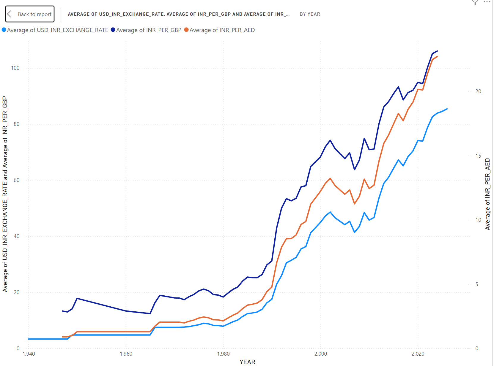

# INR Depreciation vs Fuel Prices — Analysis Report

**Objective:** Investigate the relationship between rupee depreciation and domestic fuel prices in India, from 1947 to 2026.

**Data Sources:**
- India Fuel Price History (1947–2026) — monthly petrol/diesel prices, crude oil prices, USD/INR exchange rate, tagged historical events
- India INR Exchange Rate History (1947–2026) — yearly INR conversion rates vs USD, GBP, AED

**Pipeline:** Raw CSVs → Snowflake (seeds) → dbt staging models → dbt analytics mart (joined on year) → tested (4 not-null tests) → Power BI

---

## Chart 1: Petrol Price vs USD/INR Exchange Rate

Petrol prices and the USD/INR exchange rate rise together almost in lockstep, especially post-2000 — both increased roughly 10x in the last three decades.

## Chart 2: Event Impact on Petrol Price

Years flagged with major events (oil shocks, wars, COVID-19, policy reforms) show the sharpest petrol price increases, supporting the idea that external shocks accelerate the trend.

## Chart 3: Petrol Price vs INR/AED

INR/AED tracks petrol prices almost identically to USD — expected, since AED is pegged to USD.

## Chart 4: USD vs GBP vs AED (Combined Currency View)

The rupee has weakened similarly against GBP and AED, not just USD — broad rupee depreciation, not a USD-specific factor.

---

## Conclusion

Since India imports the majority of its crude oil in USD, a weakening rupee directly raises the cost of imported fuel — explaining why domestic petrol prices rise even when global crude oil prices remain flat. The correlation between currency depreciation and fuel inflation is consistent across multiple currencies (USD, GBP, AED), reinforcing that the root cause is **rupee weakness**, not international oil markets alone.